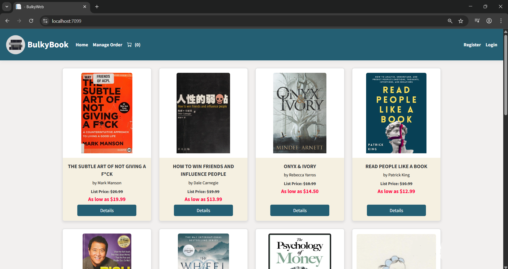

# 🛒 'BulkyBook' E-Commerce Web Application (ASP.NET Core MVC)

This is a full-stack e-commerce web application developed using **ASP.NET Core MVC** as part of an internship program. The project is based on the [Complete ASP.NET Core and Entity Framework Development course on Udemy](https://www.udemy.com/course/complete-aspnet-core-21-course/?kw=mvc&src=sac&couponCode=24T3MT100725A).

## 🚀 Features

- Product listing and details pages
- Shopping cart functionality
- Order placement and checkout
- User registration and login
- Admin dashboard for managing products, categories, and orders
- Role-based access control (Admin / User)
- Responsive design using Bootstrap
- Database integration with Entity Framework Core
- ASP.NET Core Identity for user management

## 🛠️ Technologies Used

- ASP.NET Core MVC (.NET 6 or 7)
- Entity Framework Core (Code First)
- Razor Pages
- SQL Server
- ASP.NET Identity
- Bootstrap 5
- LINQ

## 📁 Project Structure

- `Models/` – Domain entities and ViewModels  
- `Controllers/` – MVC Controllers for handling requests  
- `Views/` – Razor views for rendering UI  
- `Data/` – ApplicationDbContext and EF Core setup  
- `Areas/Admin/` – Admin-specific pages and logic  

## 📸 Screenshots



## 🔧 Setup Instructions

1. Clone this repository  

```
git clone [https://github.com/your-username/ecommerce-mvc-app.git](https://github.com/your-username/ecommerce-mvc-app.git)
```

2. Open the solution in Visual Studio  

3. Apply migrations and update the database:

```
Update-Database
```

4. Run the application

## 📚 Credits

This project was developed by following the [Complete ASP.NET Core and Entity Framework Development course](https://www.udemy.com/course/complete-aspnet-core-21-course/?kw=mvc&src=sac&couponCode=24T3MT100725A) on Udemy during an internship program.

---

## 📄 License

This project is for educational purposes only.

